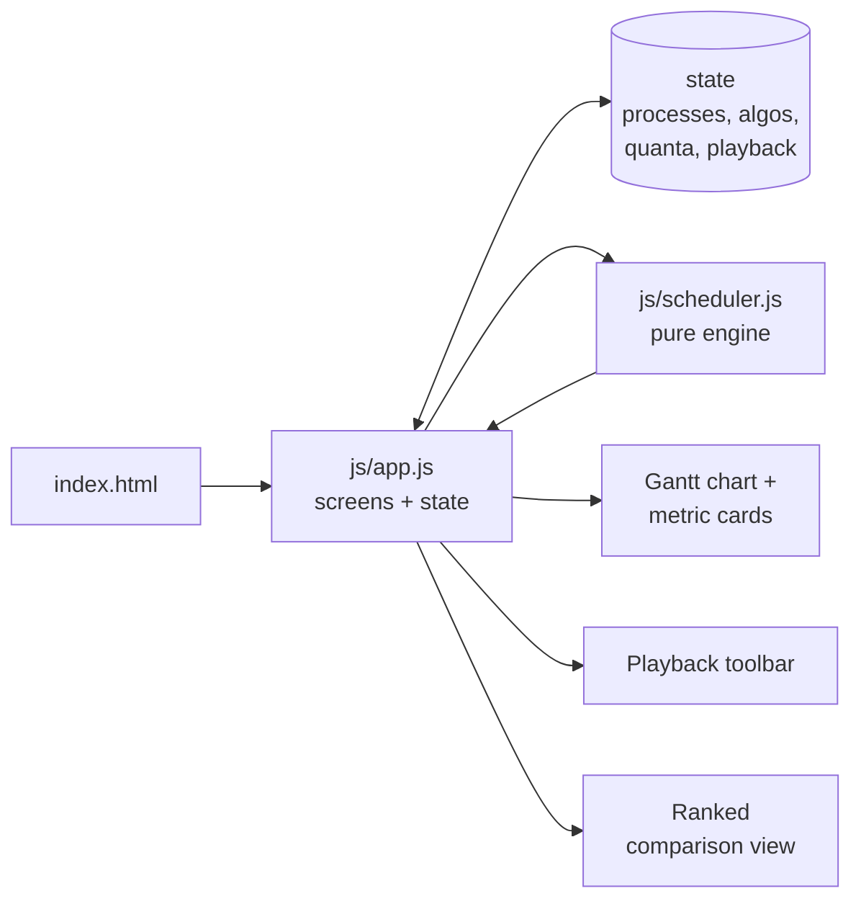
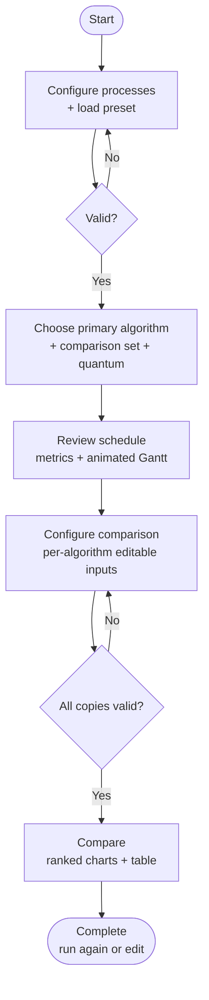

# Designing Algorithm Visualizer for CPU Scheduling Algorithms

> **A note on the figures in this report:** every `Figure N` below is a screenshot
> placeholder. Take a screenshot of the named screen in the running app, save it
> as the given file name inside the `report-images/` folder (create it next to
> this file), and the image will appear in place of the placeholder. Example:
> `report-images/fig-03-overview.png` for Figure 3.

---

## 1. Project Title

**"Designing Algorithm Visualizer for CPU Scheduling Algorithms"** is a
browser-based educational project developed for the Operating Systems Lab. The
application is presented as **"CPU Scheduling Visualizer"** and shows, step by
step, how six classic CPU scheduling algorithms order process execution and how
those orderings change the standard scheduling metrics.

Unlike a static write-up, the visualizer is fully interactive: the user types in
their own processes, picks an algorithm, watches the schedule play out on an
animated Gantt chart, and then re-runs the *same* workload under every
algorithm to see which one behaves best — all without leaving the browser.

---

## 2. Problem Statement

CPU scheduling is one of the most calculation-heavy topics in an Operating
Systems course. For every process the student must track the arrival time,
burst time, execution order, completion time, turnaround time, and waiting
time — and a single slip in a hand-drawn Gantt chart silently corrupts every
number that follows.

Preemptive algorithms make this much harder. In Round Robin a process can leave
and re-enter the ready queue several times; in Shortest Remaining Time First
the running process can be interrupted mid-execution the moment a shorter job
arrives. Comparing algorithms by hand is even worse, because the same workload
has to be re-simulated from scratch once per algorithm.

This project removes that friction with an interactive visualizer. The user
configures process data once, chooses a scheduling algorithm, immediately sees
the generated Gantt chart with all calculated metrics, can replay the schedule
clock tick by tick, and can compare all six algorithms side by side on
identical — or deliberately different — inputs.

---

## 3. Objectives

- [x] Build a simple, guided, interactive visualizer for CPU scheduling algorithms.
- [x] Let the user add, edit, and remove processes using Process ID, Arrival Time, Burst Time, and Priority.
- [x] Implement FCFS, SJF, Priority Scheduling, Round Robin, SRTF, and LJF with precise tie-breaking.
- [x] Generate a Gantt chart showing the order and duration of every execution segment, including CPU idle gaps.
- [x] Calculate Completion Time (CT), Turnaround Time (TAT), Waiting Time (WT), average WT, average TAT, and CPU idle time automatically.
- [x] Make the Round Robin time quantum user-configurable, both for single runs and for comparisons.
- [x] Add an animated playback mode (play, pause, step, speed control) so a schedule can be studied as it unfolds.
- [x] Provide a comparison view with ranked charts so algorithms can be studied side by side.
- [x] Allow **per-algorithm inputs** in the comparison setup, so each algorithm can be tested against its own edited workload without touching the others.
- [x] Guard every step with validation so invalid process data can never reach the simulation.
- [x] Ship a polished dark-mode-first interface that works on desktop and mobile with no build step and no backend.

---

## 4. Contribution

The work was split across interface design, scheduling logic, comparison and
playback features, testing, and documentation. Each member owned primary areas,
while integration, debugging, result verification, and final review were done
jointly, so the overall contribution stayed balanced.

| Team Member | Primary Contributions |
|---|---|
| **Jannat Hossain** | Project planning and screen-flow design; process-configuration screen including the preset-workload dropdown; FCFS and SJF scheduling functions; shared testing, debugging, metric checking, and final review. |
| **Attini Aziz Ditiya** | Interface styling and dark-mode theme; algorithm-selection screens; Priority Scheduling and LJF functions; Gantt-chart rendering and comparison-view integration; shared testing, debugging, metric checking, and final review. |
| **Kazi Abu Rahid** | Documentation and report organization; Round Robin and SRTF functions with quantum handling; interactive playback engine and per-algorithm comparison inputs; screenshot preparation and cross-checking of algorithm outputs; shared testing, debugging, metric checking, and final review. |

*Overall contribution: the three members contributed equally. The table lists
each member's main working areas; integration, bug fixing, validation, result
verification, and final review were shared responsibilities.*

---

## 5. Implementation

The project is a **zero-dependency client-side app**: plain HTML, vanilla
JavaScript (ES modules), and Tailwind CSS loaded from a CDN. There is no build
tool, no framework, and no server — opening `index.html` in a browser runs the
whole visualizer, and all state (including the dark-mode preference) lives in
the page and `localStorage`.

### 5.1 Tools and Technologies

| Technology | Use in the Project |
|---|---|
| HTML + Vanilla JavaScript (ES modules) | All application logic, screens, and scheduling algorithms — no framework. |
| Tailwind CSS (CDN, `darkMode: 'class'`) | Responsive layout, dark/light theming, and component styling. |
| Browser `localStorage` | Persists the dark-mode preference (`cpuDarkMode`, dark by default). |
| Inline SVG (Heroicons / Lucide style) | Crisp vector icons for navigation, metrics, and playback controls. |

### 5.2 Main Source Files and Code

| Source File | Responsibility |
|---|---|
| `index.html` | Page shell, Tailwind CDN setup with `darkMode: 'class'`, fonts, scrollbar/theme styles, and the `#app` mount point. |
| `js/app.js` | All eight screens, global state, theme handling, preset menu, validation wiring, interactive playback, per-algorithm comparison inputs, ranked comparison view, and metric tables. |
| `js/scheduler.js` | Input validation, the six scheduling algorithms, Gantt-segment creation, and CT/TAT/WT metric computation. |

### 5.3 Application Architecture

The browser renders screens produced by `js/app.js`. A single global `state`
object holds the processes, the selected algorithms, quanta, per-algorithm
comparison copies, and playback status. The pure functions in `js/scheduler.js`
take process lists in and return Gantt segments plus metrics — they never touch
the DOM, which keeps the engine independently testable. Results flow back into
the Gantt renderer, the metric cards, and the comparison charts.



**Figure 1:** Application architecture of the CPU Scheduling Visualizer.
*(Diagram above; optionally replace with an uploaded image:
`report-images/fig-01-architecture.png`.)*

### 5.4 Implementation Procedure

1. Model each process with Process ID, Arrival Time, Burst Time, and Priority.
2. Validate the process list (and every per-algorithm copy) before running anything.
3. Let the user pick one primary algorithm — and any subset of the six for comparison — plus the Round Robin time quantum.
4. Run the pure scheduler to produce Gantt segments, inserting `IDLE` segments whenever no process has arrived.
5. Derive CT, TAT, WT, averages, makespan, and idle time from the segments.
6. Render the statistics, animated Gantt chart, and per-process table on the Review screen.
7. In comparison mode, run each selected algorithm against its own (optionally edited) input and rank the results by average waiting time.

### 5.5 Process Input and Validation

Each process carries four values: Process ID (PID), Arrival Time (AT), Burst
Time (BT), and Priority. The app ships with four one-click preset workloads —
*Report Benchmark*, *Classic 4-Process*, *With CPU Idle Gaps*, and *Convoy
Effect Demonstration* — served from a custom dropdown in the Process List card
header that previews each workload's processes before loading.

| Input | Validation Rule |
|---|---|
| Process list | At least one process is required. |
| Process ID | Cannot be empty and must be unique. |
| Arrival Time | Must be 0 or greater. |
| Burst Time | Must be 1 or greater. |
| Priority | Must be 1 or greater (lower number = higher priority). |
| Comparison selection | At least two algorithms must be selected. |
| Round Robin quantum | Must be 1 or greater. |

Validation runs both on the main Step 1 table and independently inside every
per-algorithm card in Step 4, so a typo in one algorithm's copy blocks only the
comparison until it is fixed.

### 5.6 Scheduling Algorithms

The engine normalizes every input (trims IDs, clamps numbers into legal
ranges), runs the chosen algorithm, and merges adjacent same-process segments.
Deterministic tie-breakers (arrival time, then process ID) keep every run
reproducible.

| Algorithm | Type | Selection Rule |
|---|---|---|
| FCFS | Non-preemptive | Earliest arrived process, runs to completion. |
| SJF | Non-preemptive | Smallest burst among arrived processes. |
| Priority | Non-preemptive | Lowest priority number = highest priority. |
| Round Robin | Preemptive | FIFO ready queue, up to one quantum per turn, unfinished process re-queued. |
| SRTF | Preemptive | Each time unit, the arrived process with the shortest *remaining* time. |
| LJF | Non-preemptive | Largest burst among arrived processes. |

### 5.7 Metric Calculation

The last end-time of each process in the Gantt chart becomes its Completion
Time (CT); everything else follows from it:

- Turnaround Time (TAT) = CT − AT
- Waiting Time (WT) = TAT − BT
- Average WT = ΣWT / N, Average TAT = ΣTAT / N
- CPU Idle Time = sum of all `IDLE` segment durations
- Makespan = end time of the final segment

### 5.8 Flowchart



**Figure 2:** Overall user flow of the CPU Scheduling Visualizer.

### 5.9 User Interface

The interface is a guided eight-screen flow with a progress header
(Overview → Course Info → 1. Processes → 2. Algorithm → 3. Review →
4. Setup → 5. Compare → Complete), a persistent dark/light toggle, and a
fully responsive layout. Dark mode is the default; the choice is remembered in
`localStorage`.


<!-- Upload: screenshot of the Overview/intro screen -> report-images/fig-03-overview.png -->

**Figure 3:** Introduction screen of the CPU Scheduling Visualizer.


<!-- Upload: screenshot of the Course Info screen -> report-images/fig-04-course-info.png -->

**Figure 4:** Course and group details screen.


<!-- Upload: screenshot of Step 1 with the preset menu open -> report-images/fig-05-configure.png -->

**Figure 5:** Configure Processes screen with the Process List card and the
custom Load Preset dropdown.


<!-- Upload: screenshot of Step 2 -> report-images/fig-06-algorithm.png -->

**Figure 6:** Algorithm selection and comparison selection screen.


<!-- Upload: screenshot of Step 3, ideally mid-playback -> report-images/fig-07-review.png -->

**Figure 7:** Review Schedule screen showing average values, the Gantt chart,
and the interactive playback toolbar.


<!-- Upload: screenshot of the detailed metrics table + formulas -> report-images/fig-08-result-table.png -->

**Figure 8:** Per-process result table (AT, BT, Priority, CT, TAT, WT) with the
formula breakdown.


<!-- Upload: screenshot of Step 4 with one card expanded -> report-images/fig-09-compare-setup.png -->

**Figure 9:** Comparison setup — each algorithm starts from the Step 1
processes but is fully editable on its own collapsible card, including the
Round Robin quantum.


<!-- Upload: screenshot of Step 5 -> report-images/fig-10-comparison.png -->

**Figure 10:** Final comparison summary with ranked bar charts, Best badges,
and the metrics table.


<!-- Upload: screenshot of the Complete screen -> report-images/fig-11-complete.png -->

**Figure 11:** Final screen with options to run the simulation again or modify
the current processes.

### 5.10 Main Scheduling Algorithm Source Code and Visual Output

The six functions below are taken verbatim from `js/scheduler.js`. Each is
shown with the Gantt output it produces for the Section 6 benchmark workload
so code and behavior can be checked against each other.

#### 5.10.1 First Come First Serve (FCFS)

Non-preemptive; the earliest arrived process runs to completion.

```js
// FCFS - Non-preemptive; earliest arrived process runs to completion.
export function fcfs(input) {
  const processes = [...input].sort(
    (a, b) => a.at - b.at || a.id.localeCompare(b.id),
  );
  const gantt = [];
  let time = 0;
  processes.forEach((process) => {
    if (time < process.at) {
      addSegment(gantt, 'IDLE', time, process.at);
      time = process.at;
    }
    addSegment(gantt, process.id, time, time + process.bt);
    time += process.bt;
  });
  return { gantt };
}
```


<!-- Upload: FCFS Gantt screenshot -> report-images/fig-12-fcfs.png -->

**Figure 12:** First Come First Serve visual output — P1 → P2 → P3 → P5 → P4.

#### 5.10.2 Shortest Job First (SJF)

Non-preemptive; picks the smallest burst among arrived processes.

```js
// SJF - Non-preemptive; shortest burst among arrived processes.
export function sjf(input) {
  const processes = [...input];
  const completed = new Set();
  const gantt = [];
  let time = 0;
  while (completed.size < processes.length) {
    const available = processes
      .filter((p) => !completed.has(p.id) && p.at <= time)
      .sort((a, b) => a.bt - b.bt || a.at - b.at || a.id.localeCompare(b.id));
    if (!available.length) {
      const next = processes
        .filter((p) => !completed.has(p.id))
        .sort((a, b) => a.at - b.at)[0];
      addSegment(gantt, 'IDLE', time, next.at);
      time = next.at;
      continue;
    }
    const process = available[0];
    addSegment(gantt, process.id, time, time + process.bt);
    time += process.bt;
    completed.add(process.id);
  }
  return { gantt };
}
```


<!-- Upload: SJF Gantt screenshot -> report-images/fig-13-sjf.png -->

**Figure 13:** Shortest Job First visual output — P1 → P5 → P4 → P2 → P3.

#### 5.10.3 Priority Scheduling

Non-preemptive; the smallest numeric priority runs first.

```js
// Priority - Non-preemptive; lowest numeric priority value is highest priority.
export function priorityScheduling(input) {
  const processes = [...input];
  const completed = new Set();
  const gantt = [];
  let time = 0;
  while (completed.size < processes.length) {
    const available = processes
      .filter((p) => !completed.has(p.id) && p.at <= time)
      .sort(
        (a, b) =>
          a.priority - b.priority || a.at - b.at || a.id.localeCompare(b.id),
      );
    if (!available.length) {
      const next = processes
        .filter((p) => !completed.has(p.id))
        .sort((a, b) => a.at - b.at)[0];
      addSegment(gantt, 'IDLE', time, next.at);
      time = next.at;
      continue;
    }
    const process = available[0];
    addSegment(gantt, process.id, time, time + process.bt);
    time += process.bt;
    completed.add(process.id);
  }
  return { gantt };
}
```


<!-- Upload: Priority Gantt screenshot -> report-images/fig-14-priority.png -->

**Figure 14:** Priority Scheduling visual output — P1 → P2 → P5 → P4 → P3.

#### 5.10.4 Round Robin (RR)

Preemptive; each ready process runs up to one quantum, then re-queues if
unfinished.

```js
// Round Robin - Preemptive; FIFO ready queue, runs up to one quantum.
export function roundRobin(input, quantum = 2) {
  const q = Math.max(1, Number(quantum) || 2);
  const processes = [...input].sort(
    (a, b) => a.at - b.at || a.id.localeCompare(b.id),
  );
  const remaining = new Map(
    processes.map((p) => [p.id, p.bt]),
  );
  const gantt = [];
  const queue = [];
  let time = 0;
  let index = 0;
  let completed = 0;
  while (completed < processes.length) {
    while (index < processes.length && processes[index].at <= time) {
      queue.push(processes[index]);
      index += 1;
    }
    if (!queue.length && index < processes.length) {
      addSegment(gantt, 'IDLE', time, processes[index].at);
      time = processes[index].at;
      continue;
    }
    const process = queue.shift();
    const left = remaining.get(process.id);
    const execution = Math.min(left, q);
    addSegment(gantt, process.id, time, time + execution);
    time += execution;
    remaining.set(process.id, left - execution);
    while (index < processes.length && processes[index].at <= time) {
      queue.push(processes[index]);
      index += 1;
    }
    if (remaining.get(process.id) > 0) {
      queue.push(process);
    } else {
      completed += 1;
    }
  }
  return { gantt };
}
```


<!-- Upload: Round Robin Gantt screenshot -> report-images/fig-15-rr.png -->

**Figure 15:** Round Robin visual output with q = 2 — P1 → P2 → P3 → P5 →
P1 → P4 → P2 → P3 → P1 → P3.

#### 5.10.5 Shortest Remaining Time First (SRTF)

Preemptive; every time unit, the arrived process with the least remaining time
takes the CPU.

```js
// SRTF - Preemptive; re-evaluates each time unit, picks shortest remaining.
export function srtf(input) {
  const processes = [...input];
  const remaining = new Map(
    processes.map((p) => [p.id, p.bt]),
  );
  const gantt = [];
  let time = 0;
  let completed = 0;
  while (completed < processes.length) {
    const available = processes
      .filter((p) => p.at <= time && remaining.get(p.id) > 0)
      .sort(
        (a, b) =>
          remaining.get(a.id) - remaining.get(b.id) ||
          a.at - b.at ||
          a.id.localeCompare(b.id),
      );
    if (!available.length) {
      const future = processes
        .filter((p) => remaining.get(p.id) > 0)
        .sort((a, b) => a.at - b.at)[0];
      addSegment(gantt, 'IDLE', time, future.at);
      time = future.at;
      continue;
    }
    const process = available[0];
    addSegment(gantt, process.id, time, time + 1);
    remaining.set(process.id, remaining.get(process.id) - 1);
    time += 1;
    if (remaining.get(process.id) === 0) {
      completed += 1;
    }
  }
  return { gantt };
}
```


<!-- Upload: SRTF Gantt screenshot -> report-images/fig-16-srtf.png -->

**Figure 16:** Shortest Remaining Time First visual output — P1 → P2 → P5 →
P2 → P4 → P1 → P3.

#### 5.10.6 Longest Job First (LJF)

Non-preemptive; picks the largest burst among arrived processes — included to
demonstrate worst-case scheduling delays.

```js
// LJF - Non-preemptive; largest burst among arrived processes.
export function ljf(input) {
  const processes = [...input];
  const completed = new Set();
  const gantt = [];
  let time = 0;
  while (completed.size < processes.length) {
    const available = processes
      .filter((p) => !completed.has(p.id) && p.at <= time)
      .sort((a, b) => b.bt - a.bt || a.at - b.at || a.id.localeCompare(b.id));
    if (!available.length) {
      const next = processes
        .filter((p) => !completed.has(p.id))
        .sort((a, b) => a.at - b.at)[0];
      addSegment(gantt, 'IDLE', time, next.at);
      time = next.at;
      continue;
    }
    const process = available[0];
    addSegment(gantt, process.id, time, time + process.bt);
    time += process.bt;
    completed.add(process.id);
  }
  return { gantt };
}
```


<!-- Upload: LJF Gantt screenshot -> report-images/fig-17-ljf.png -->

**Figure 17:** Longest Job First visual output — P1 → P3 → P2 → P4 → P5.

---

## 6. Result

### 6.1 Test Workload

Results were produced by running the project's own engine
(`js/scheduler.js`) on the built-in **Report Benchmark** preset — the same
five-process workload used throughout this report. The Round Robin quantum was
2 time units. Every number below is engine output, not hand calculation.

| PID | AT | BT | Priority |
|---|---|---|---|
| P1 | 0 | 5 | 2 |
| P2 | 1 | 3 | 1 |
| P3 | 2 | 8 | 3 |
| P4 | 4 | 2 | 2 |
| P5 | 2 | 1 | 1 |

### 6.2 Detailed FCFS Result

FCFS executes strictly in arrival order, giving the Gantt sequence
P1 → P2 → P3 → P5 → P4 (note P5 finishes before P4 because it arrived
earlier):

| PID | AT | BT | Priority | CT | TAT | WT |
|---|---|---|---|---|---|---|
| P1 | 0 | 5 | 2 | 5 | 5 | 0 |
| P2 | 1 | 3 | 1 | 8 | 7 | 4 |
| P3 | 2 | 8 | 3 | 16 | 14 | 6 |
| P4 | 4 | 2 | 2 | 19 | 15 | 13 |
| P5 | 2 | 1 | 1 | 17 | 15 | 14 |

Average WT = (0 + 4 + 6 + 13 + 14) / 5 = **7.40**
Average TAT = (5 + 7 + 14 + 15 + 15) / 5 = **11.20**

### 6.3 Algorithm Comparison

| Algorithm | Avg WT | Avg TAT | Idle | Makespan |
|---|---|---|---|---|
| FCFS | 7.40 | 11.20 | 0 | 19 |
| SJF | 4.20 | 8.00 | 0 | 19 |
| Round Robin (q = 2) | 7.20 | 11.00 | 0 | 19 |
| Priority | 4.80 | 8.60 | 0 | 19 |
| SRTF | 3.40 | 7.20 | 0 | 19 |
| LJF | 8.60 | 12.40 | 0 | 19 |

For this workload, **SRTF wins on both averages** (WT 3.40, TAT 7.20),
followed by SJF and Priority Scheduling. Round Robin trades raw waiting time
for fair time-sharing (q = 2), while LJF finishes last because the long P3
job runs early and stalls the shorter processes behind it — exactly the
convoy-style behavior LJF is included to demonstrate.

All six algorithms report idle time 0: a process is available from time 0 and
the CPU stays busy until time 19, so there is simply no gap to be idle in.
These rankings belong to this workload only and are not a universal ordering
of the algorithms.

---

## 7. Conclusion

The CPU Scheduling Visualizer successfully demonstrates six scheduling
algorithms — FCFS, SJF, Priority, Round Robin, SRTF, and LJF — through an
eight-screen guided flow: process configuration with one-click presets, single
algorithm review with animated Gantt playback, per-algorithm comparison setup,
ranked side-by-side comparison, and a completion screen.

Three properties make it genuinely useful as a study tool rather than a static
demo. First, every figure on screen is computed live by a dependency-free
engine, so students can test their own workloads instead of replaying canned
answers. Second, the playback controls and per-process formula breakdowns
expose *how* each number arises, not just the final averages. Third, the
per-algorithm comparison inputs let students ask "what if this workload were
slightly different for just one algorithm?" and get an immediate, fairly
ranked answer.

Overall, the project fulfills its goal: a simple, readable, dark-mode-first
educational visualizer for the Operating Systems Lab that runs anywhere a
browser runs.
