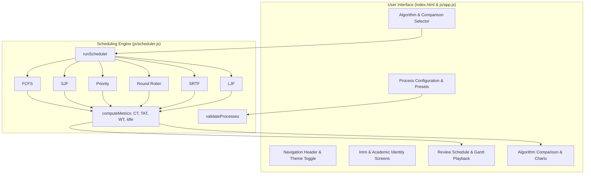

# CPU Scheduling Visualizer Implementation Plan

> **For agentic workers:** REQUIRED SUB-SKILL: Use superpowers:subagent-driven-development to implement this plan task-by-task. Steps use checkbox (`- [ ]`) syntax for tracking.

**Goal:** Build a complete, browser-native CPU Scheduling Visualizer in Vanilla JS and Tailwind CSS implementing all 6 scheduling algorithms (FCFS, SJF, Priority, Round Robin, SRTF, LJF), interactive Gantt chart with live playback animation, detailed metrics table, presets, and side-by-side comparison.

**Architecture:** A decoupled, browser-native design consisting of `js/scheduler.js` (pure deterministic scheduling engine and metric calculations) and `js/app.js` (state management, step-by-step navigation, animated timeline engine, and Tailwind UI rendering), served through `index.html`.

**Architecture Diagram:**



**Tech Stack:** Pure Vanilla JavaScript (ES6+ modules), Tailwind CSS (via CDN), HTML5, Google Fonts (Inter & JetBrains Mono).

## Global Constraints
- Pure vanilla JS; no Node/npm build step required to run in browser.
- Uses exact formulas and test results from `final_v1.pdf`:
  - Turnaround Time: $TAT = CT - AT$
  - Waiting Time: $WT = TAT - BT$
  - Tie-breaking: arrival time `at` ascending, then process ID `id` lexicographically.
  - Priority: lower numeric value represents higher priority.
  - Adjacent identical Gantt segments must be merged in `addSegment`.

---

### Task 1: Core Scheduling Engine and Metric Verification (`js/scheduler.js`)

**Files:**
- Modify: `js/scheduler.js`
- Test: `tests/test_scheduler.mjs`

**Interfaces:**
- Produces:
  - `addSegment(gantt, id, start, end)`
  - `validateProcesses(processes)`
  - `fcfs(input)`, `sjf(input)`, `priorityScheduling(input)`, `roundRobin(input, quantum)`, `srtf(input)`, `ljf(input)`
  - `computeMetrics(processes, gantt)`
  - `runScheduler(processes, algorithm, quantum)`

- [ ] **Step 1: Write the failing unit test for scheduler engine**
Create `tests/test_scheduler.mjs` testing all 6 algorithms against the exact test workload from Section 6 of `final_v1.pdf` (P1 to P5).
Verify expected Avg WT: FCFS=7.40, SJF=4.20, RR(q=2)=7.20, Priority=4.80, SRTF=3.40, LJF=8.60; Avg TAT: FCFS=11.20, SJF=8.00, RR=11.00, Priority=8.60, SRTF=7.20, LJF=12.40.

- [ ] **Step 2: Run test to verify it fails or checks missing exports**
Run: `node tests/test_scheduler.mjs`
Expected: FAIL due to missing ES module exports or unmerged segments in SRTF.

- [ ] **Step 3: Update `js/scheduler.js` with ES module exports and segment merging**
Add adjacent segment merging to `addSegment` and export all functions as ES modules:
```javascript
export { addSegment, validateProcesses, fcfs, sjf, priorityScheduling, roundRobin, srtf, ljf, computeMetrics, runScheduler };
```

- [ ] **Step 4: Run test to verify all 6 algorithms pass with exact metrics**
Run: `node tests/test_scheduler.mjs`
Expected: PASS (all metrics match Section 6 of report to 2 decimal places).

- [ ] **Step 5: Commit**
```bash
git add js/scheduler.js tests/test_scheduler.mjs
git commit -m "feat: complete scheduler engine with segment merging and verified metrics"
```

---

### Task 2: Fix App Shell & Implement Step-by-Step Navigation & Identity Screens (`index.html`, `js/app.js`)

**Files:**
- Modify: `index.html:38-42`
- Modify: `js/app.js`

**Interfaces:**
- Consumes: `js/scheduler.js`
- Produces: `window.app = { goTo, toggleDark, ... }`, responsive step navigation, `intro` and `identity` views.

- [ ] **Step 1: Fix script import in `index.html`**
Update `index.html` from `<script type="module" src="/app.js"></script>` to `<script type="module" src="./js/app.js"></script>`.

- [ ] **Step 2: Implement step navigation, header, footer, and theme state in `js/app.js`**
Define complete screen mapping: `intro`, `identity`, `configure`, `algorithm`, `review`, `compare-setup`, `comparison`, `end`.
Support both Next/Back buttons and clickable step pills in the top navbar.
Support light/dark mode toggling with `localStorage` persistence.

- [ ] **Step 3: Implement Intro and Course & Identity views in `js/app.js`**
Render Intro screen with project title, feature highlights, and action buttons.
Render Course & Group Details screen with Course Code (CSE362), Section 04, Project Title, and Group Members (Tasir Rahman, Azizul Hakim Omor, Saiful Islam Riad).

- [ ] **Step 4: Verify in Node / test script that navigation and HTML templates render cleanly**
Run test script verifying `renderApp()` produces valid markup for `intro` and `identity`.

- [ ] **Step 5: Commit**
```bash
git add index.html js/app.js
git commit -m "feat: implement navigation shell, intro, and course identity screens"
```

---

### Task 3: Complete Process Configuration Screen with Presets & Live Validation (`js/app.js`)

**Files:**
- Modify: `js/app.js`

**Interfaces:**
- Consumes: `validateProcesses` from `js/scheduler.js`
- Produces: `app.addProcess()`, `app.removeProcess(index)`, `app.updateProcess(index, field, value)`, `app.loadPreset(presetKey)`, `app.resetAll()`.

- [ ] **Step 1: Add rich preset workloads to `PRESETS`**
Include:
1. `report`: Table 6.1 (P1-P5)
2. `simple`: 4-process classic set
3. `idle`: workload that creates CPU idle segments
4. `convoy`: 1 heavy burst followed by short bursts (demonstrating FCFS convoy effect)
5. `random`: generates 4-6 random valid processes

- [ ] **Step 2: Implement dynamic process table controls and real-time input handling**
Allow adding rows, deleting rows, inline editing of AT, BT, and Priority.

- [ ] **Step 3: Implement live validation banner**
Display validation errors if PID is duplicate/empty, AT < 0, BT < 1, or Priority < 1, preventing progression until fixed.

- [ ] **Step 4: Verify preset loading and validation in tests**
Run automated check on presets and validation behavior.

- [ ] **Step 5: Commit**
```bash
git add js/app.js
git commit -m "feat: add process configuration with rich presets and live validation"
```

---

### Task 4: Algorithm Selection Screen & Comparison Configuration (`js/app.js`)

**Files:**
- Modify: `js/app.js`

**Interfaces:**
- Produces: `app.selectAlgo(key)`, `app.toggleComparisonAlgo(key)`, `app.setQuantum(val)`.

- [ ] **Step 1: Implement Algorithm Cards with Type Badges and Descriptions**
Display all 6 algorithms (FCFS, SJF, Priority, Round Robin, SRTF, LJF) with Preemptive / Non-preemptive badges and concise explanations.

- [ ] **Step 2: Implement Dynamic Round Robin Quantum Input**
Display and bind the quantum input (default 2) when Round Robin is chosen or in comparison.

- [ ] **Step 3: Implement Multi-Select Comparison Picker**
Allow users to select 2 or more algorithms for comparison with checkboxes and validation.

- [ ] **Step 4: Verify algorithm selection state changes**
Ensure `state.selectedAlgo`, `state.quantum`, and `state.comparisonAlgos` persist properly.

- [ ] **Step 5: Commit**
```bash
git add js/app.js
git commit -m "feat: implement algorithm selection and comparison configuration"
```

---

### Task 5: Review Schedule Screen with Interactive Gantt & Live Timeline Playback (`js/app.js`)

**Files:**
- Modify: `js/app.js`

**Interfaces:**
- Consumes: `runScheduler` from `js/scheduler.js`
- Produces: `reviewView()`, `app.togglePlay()`, `app.stepForward()`, `app.stepBack()`, `app.resetPlayback()`, `app.setPlaybackSpeed(speed)`.

- [ ] **Step 1: Build Metric Summary Cards**
Display Average Waiting Time, Average Turnaround Time, Total Makespan, and CPU Idle Time with clean icons and styling.

- [ ] **Step 2: Build Interactive Gantt Chart**
Render proportional time segments with process colors, striped Idle blocks, hover tooltips, and time markers.

- [ ] **Step 3: Build Live Timeline Playback Engine**
Add a playback control bar: Play / Pause, Step Forward, Step Back, Reset, Speed ($0.5\times, 1\times, 2\times$), and a live timeline ticker showing the currently active process and ready queue at current time $t$.

- [ ] **Step 4: Build Detailed Process Metrics Table & Formula Breakdown**
Table with columns: PID, AT, BT, Priority, CT, TAT, WT.
Summary footer with KaTeX-styled formula breakdown showing exactly how Average WT and Average TAT were calculated.

- [ ] **Step 5: Test and commit**
```bash
git add js/app.js
git commit -m "feat: implement review schedule screen with interactive gantt and playback"
```

---

### Task 6: Comparison Setup, Side-by-Side Comparison Screen & End Screen (`js/app.js`)

**Files:**
- Modify: `js/app.js`

**Interfaces:**
- Produces: `compareSetupView()`, `comparisonView()`, `endView()`, comparative bar charts.

- [ ] **Step 1: Implement Comparison Setup View (`compare-setup`)**
Allow editing per-algorithm parameters (such as RR Quantum) before running comparison.

- [ ] **Step 2: Implement Comparison Summary Table with "Best" Badges & Synthesis Banner**
Highlight the best algorithm for Avg WT, Avg TAT, and Idle Time.
Render synthesis text: "Algorithm X has lowest WT, Y has lowest TAT, and Z keeps CPU idle the least."

- [ ] **Step 3: Implement Visual Comparative Bar Charts**
Render responsive horizontal percentage bars comparing Average Waiting Time and Turnaround Time across all selected algorithms.

- [ ] **Step 4: Implement Side-by-Side Gantt Cards**
Render compact Gantt chart and metric cards for each selected algorithm for visual comparison.

- [ ] **Step 5: Implement Completion Screen ("The End")**
Provide a summary note and a "Run Simulation Again" button that resets or allows tweaking inputs.

- [ ] **Step 6: Commit**
```bash
git add js/app.js
git commit -m "feat: implement comparison setup, side-by-side comparison, and end screen"
```

---

### Task 7: End-to-End Verification & Documentation

**Files:**
- Create: `tests/verify_all.mjs`
- Test: Full end-to-end check of calculations, HTML integrity, and responsive layout.

- [ ] **Step 1: Run comprehensive verification script**
Ensure all 6 algorithms, presets, and metrics match `final_v1.pdf` exactly.

- [ ] **Step 2: Verify browser readiness and file paths**
Confirm zero external broken links, valid ES module imports, and smooth dark/light mode transitions.

- [ ] **Step 3: Final commit**
```bash
git add .
git commit -m "chore: complete CPU scheduling visualizer and full verification"
```
